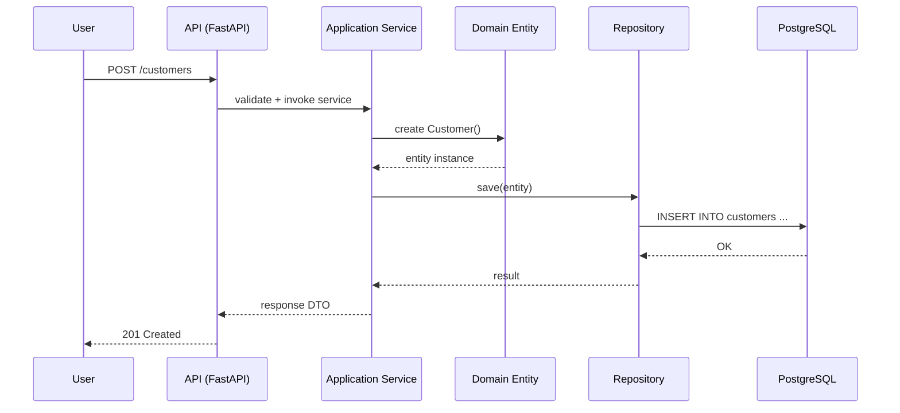

# 1. 概要

この機能の設計目的と全体像を簡潔に記述します。  
例）「顧客登録リクエストを受けて、バリデーション・永続化・監査ログ記録を行う。」

---

# 2. 処理フロー（シーケンス）

主要な処理の流れを文章またはシーケンス図で示します。

例）顧客登録処理フロー：

```text
[API層] → [Application Service] → [Domain Entity] → [Repository] → [DB]
````

または図表化（Mermaidなど）：



---

# 3. 構造設計（レイヤと責務）

| 層              | 主な責務                      | 実装対象                      |
| -------------- | ------------------------- | ------------------------- |
| Presentation   | HTTPエンドポイント、リクエストDTO、例外変換 | FastAPI Router / Pydantic |
| Application    | ユースケース実行、トランザクション管理       | Service / UseCaseクラス      |
| Domain         | ビジネスルール、集約、値オブジェクト        | Entity / ValueObject      |
| Infrastructure | DB・外部API・ストレージアクセス        | Repository / Gateway      |

> 依存方向は「外側 → 内側」へ。
> Application → Domain は許可、逆方向は禁止。

---

# 4. トランザクション設計

| 区分      | 内容                              |
| ------- | ------------------------------- |
| 一貫性単位   | 顧客登録処理単位で1トランザクション              |
| ロック戦略   | 主キー・一意キーに対する楽観ロック（`version`カラム） |
| リトライ方針  | DB衝突時に3回までリトライ（指数バックオフ）         |
| 障害補償    | 書き込み失敗時に監査ログへエラー登録              |
| 外部API連携 | 非同期ジョブで再送処理を行う（即時ではなく遅延保証）      |

> 詳細な実装は `adr/adr-xxxx-transaction-policy.md` に準拠。

---

# 5. 例外処理・エラーハンドリング

| 層              | 例外                    | 対応              | ステータスコード |
| -------------- | --------------------- | --------------- | -------- |
| Presentation   | ValidationError       | 400 Bad Request | 400      |
| Application    | BusinessRuleViolation | ロールバック、403返却    | 403      |
| Domain         | InvariantError        | ロールバック、メッセージ返却  | 422      |
| Infrastructure | DBError               | リトライ or 500     | 500      |

> 共通例外は `guidelines/api-style.md` に定義。

---

# 6. 非機能設計（この機能固有の要件）

| 区分     | 内容                          | 備考                          |
| ------ | --------------------------- | --------------------------- |
| 性能     | 同時登録100リクエスト／秒を許容           | PostgreSQL + ConnectionPool |
| 可用性    | トランザクション再試行で自動復旧            |                             |
| セキュリティ | JWTトークンの`tenant_id`でRLS制御   | DBセッションごとに適用                |
| ロギング   | OpenTelemetry TraceIDを全層で伝搬 | CloudWatch Logs連携           |
| 監査     | 成功/失敗を`audit_logs`テーブルへ記録   | after_commitフック利用           |

---

# 7. 入出力DTO / Entity 対応関係

| DTO                   | Entity   | 備考  |
| --------------------- | -------- | --- |
| CustomerCreateRequest | Customer | 作成用 |
| CustomerResponse      | Customer | 表示用 |
| CustomerUpdateRequest | Customer | 更新用 |

> DTOとEntityの変換は Application 層で明示的に実施する。

---

# 8. 外部システム連携

| 外部システム    | 用途     | インタフェース               | 再試行方針         |
| --------- | ------ | --------------------- | ------------- |
| S3        | ファイル保存 | boto3 / presigned URL | 3回リトライ        |
| Slack API | 通知     | REST Webhook          | 失敗時はジョブキューに登録 |

---

# 9. 関連ドキュメント

* `features/<feature>/spec.md` — 要件・ユースケース定義
* `features/<feature>/api/contracts.md` — API定義
* `features/<feature>/table-schema/tables.md` — DB構造
* `adr/adr-xxxx-transaction-policy.md` — トランザクション方針
* `guidelines/db-style.md` — DB命名・制約ルール

---

# 10. 未決事項 / リスク

* 並列処理時の整合性検証が未実施。
* DBの一意制約を楽観ロックでカバーするか要判断。

---

# 11. メモ / コメント

* 今後、AIエージェントによる自動実装を想定。
  このファイルを基に UseCase / Repository のスケルトン生成が可能。
* 更新時は `last_update` を忘れずに修正。

---

```

---

### 💡 このテンプレートの意図

| セクション | 目的 |
|-------------|------|
| **2章（処理フロー）** | シーケンス図や文で「動きを可視化」し、AIが実装順序を理解できるようにする |
| **3章（構造設計）** | Clean Architecture層ごとの責務を固定化し、依存方向の誤りを防止 |
| **4章（トランザクション）** | 一貫性・リトライ・補償処理のルールを明示（AI実装時に必要） |
| **5章（例外処理）** | 各層の例外変換責任を明確にして、API層が一元的に処理できるようにする |
| **6〜8章（非機能・監視）** | 運用・SRE視点の要件を同ファイルに集約 |
| **9章（関連リンク）** | 他ドキュメントとの相互参照をAIが解釈可能に |
| **10〜11章** | 未決や注意点を残すことで、AIが「まだ実装すべきでない部分」を識別できる |

---

> **運用ポイント：**  
> - 各 feature の `design.md` は「AIがコード化するための仕様書」になります。  
> - ADR/RFC にリンクしておくことで、AIが“どの設計方針に基づく処理か”を判断できます。  
> - シーケンス図やテキストフローはできる限り **冗長でも明示的に** 記述することが推奨です。
```
